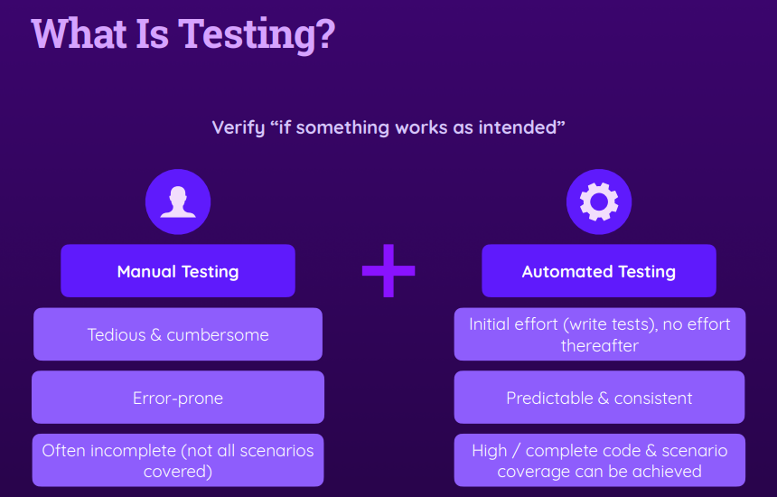
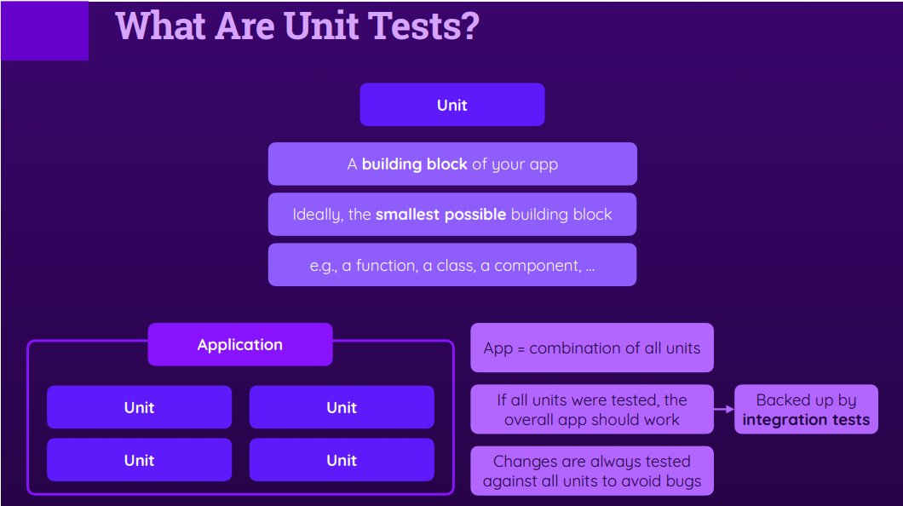
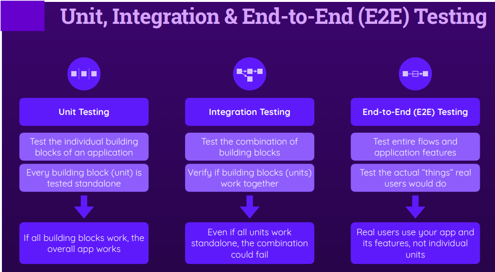
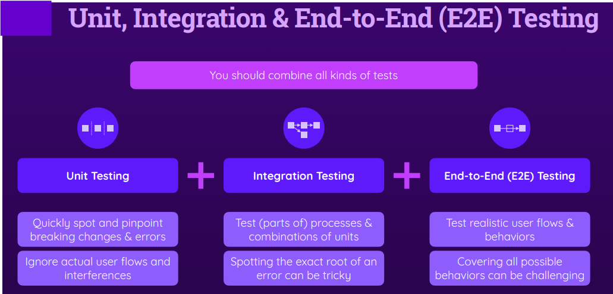
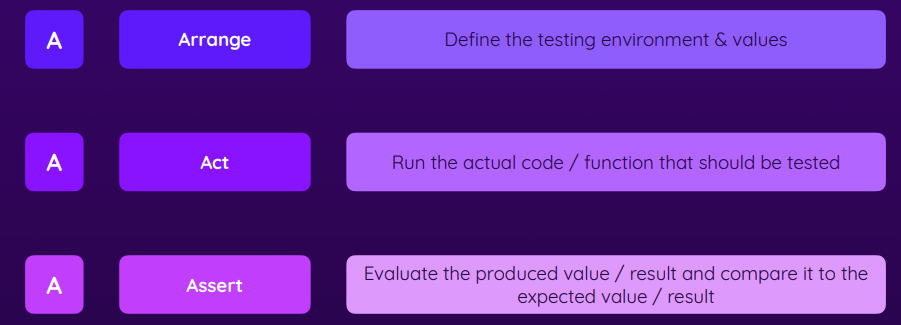
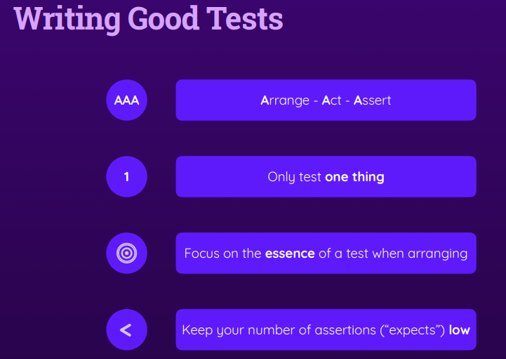
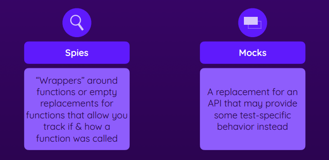

## some definitions

- **Dummy** objects are passed around but never actually used. Usually they are just used to fill parameter lists.
- **Fake** objects actually have working implementations, but usually take some shortcut which makes them not suitable for production (an InMemoryTestDatabase is a good example).
- **Stubs** provide canned answers to calls made during the test, usually not responding at all to anything outside what's programmed in for the test.
- **Spies** are stubs that also record some information based on how they were called. One form of this might be an email service that records how many messages it was sent.
- **Mocks** are pre-programmed with expectations which form a specification of the calls they are expected to receive. They can throw an exception if they receive a call they don't expect and are checked during verification to ensure they got all the calls they were expecting.

### Here's a description of each one followed by with real world sample.

- Dummy - just bogus values to satisfy the API.
Example: If you're testing a method of a class which requires many mandatory parameters in a constructor which have no effect on your test, then you may create dummy objects for the purpose of creating new instances of a class.

- Fake - create a test implementation of a class which may have a dependency on some external infrastructure. (It's good practice that your unit test does NOT actually interact with external infrastructure.)
Example: Create fake implementation for accessing a database, replace it with in-memory collection.

- Stub - override methods to return hard-coded values, also referred to as state-based.
Example: Your test class depends on a method Calculate() taking 5 minutes to complete. Rather than wait for 5 minutes you can replace its real implementation with stub that returns hard-coded values; taking only a small fraction of the time.

- Mock - very similar to Stub but interaction-based rather than state-based. This means you don't expect from Mock to return some value, but to assume that specific order of method calls are made.
Example: You're testing a user registration class. After calling Save, it should call SendConfirmationEmail.

- Stubs and Mocks are actually sub types of Mock, both swap real implementation with test implementation, but for different, specific reasons.

link: https://stackoverflow.com/questions/3459287/whats-the-difference-between-a-mock-stub

## learned methods
- vi.mock
- vi.fn
- vi.stubGlobal
- .mockImplementationOnce
- beforeAll,
  beforeEach,
  afterAll,
  afterEach
- .concurrent

